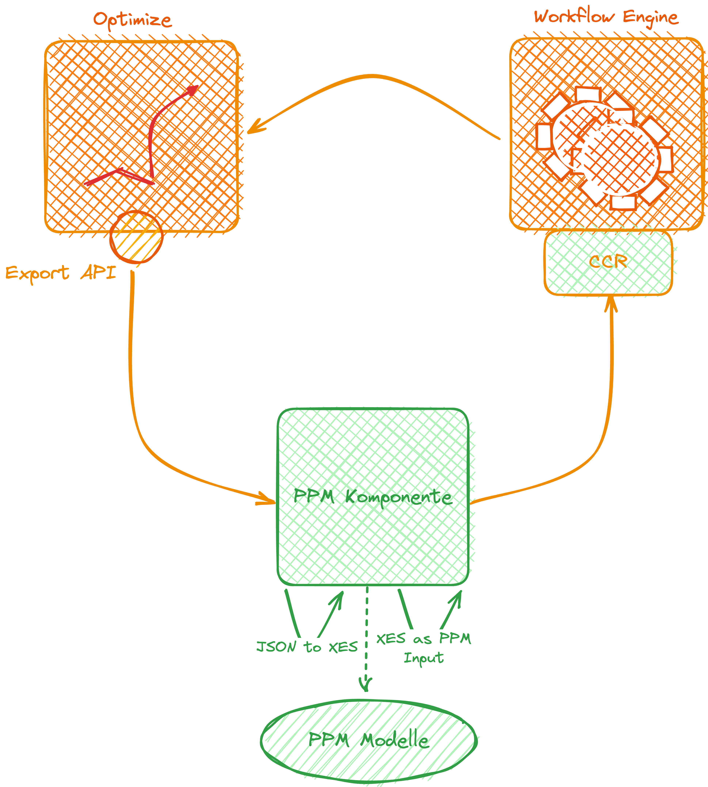

# Optimize to XES

Export [raw data from Camunda Optimize](https://docs.camunda.io/optimize/apis-tools/optimize-api/report/get-data-export/) 
and convert it to [XES](https://xes-standard.org/) for Predictive Process Monitoring

# Table of Contents

* [✨Features](#features)
  * [📤 Camunda Optimize to XES](#-camunda-optimize-to-xes)
  * [📊 XES - eXtensible Event Stream](#-xes---extensible-event-stream)
  * [🚀🔜 Coming Soon... 🌟🎉👀](#-coming-soon-)
* [🚀 Getting Started](#-getting-started)
  * [Execute native-image](#execute-native-image)
  * [Configuring `application.yaml`](#configuring-applicationyaml)
* [👨‍💻 Develop Guide](#-develop-guide)
  * [Build Native Image](#build-native-image)

# ✨Features

## 📤 Camunda Optimize to XES

Here's the scoop on this project: It's your ticket to export your raw process data from Camunda Optimize using the 
mighty [Data Export API](https://docs.camunda.io/optimize/apis-tools/optimize-api/report/get-data-export/). 🚀  
🔍 For the smoothest experience, consider applying a filter to show only completed instances. 🌟 This helps streamline your view and focus on what's done! ✅🚀

Afterward, we work our magic to transform it into the fantastic world of [XES](#-xes---extensible-event-stream). 🪄✨

## 📊 XES - eXtensible Event Stream

We rely on [XES](https://www.xes-standard.org/openxes/start), which is like a superhero cape for event data! 🦸‍♂️ 
It's a widely recognized standard that helps us structure and store event data in a machine-friendly format. This 
format is a go-to choice for process mining, allowing us to save and share event logs effortlessly. It's like a 
treasure map for uncovering insights in the world of processes and workflows! 🗺️

For our Java-powered adventures, we especially use this [OpenXES](http://code.deckfour.org/xes/) implementation. 🧑‍💻

## 🚀🔜 Coming Soon... 🌟🎉👀



# 🚀 Getting Started

## Execute native-image

You can simply download the latest native-image from the [releases here](https://github.com/envite-consulting/optimize-to-xes/releases/latest/download/optimize-to-xes) and
execute it with the following options:

```shell
./optimize-to-xes \
  --optimize.base-url='optimize_base_url' \
  --optimize.report-id='report_id' \
  --optimize.client-id='client_id' \
  --optimize.client-secret='client_secret' \
  --xes-mapping.filename='<filename-or-path>.xml'
```

If you want to provide a static Bearer Token you could ignore `client-id` and `client-secret` and 
add `bearer-token` instead.

## Configuring `application.yaml`

To set up your configuration in `application.yaml`, follow these steps:

1. Include the Optimize base URL.
2. Specify the Raw Data Report ID.
3. Add the Client ID and Secret.
4. *Optionally:* Specify the base bath for the resulting XML(s).

If you want to provide a static Bearer Token you could ignore `client-id` and `client-secret` and  
add `bearer-token` instead.

Once you've completed these configurations, you'll be prepared to retrieve the data and convert it to XES format 🎉

To install all dependencies, run the following command:

```shell
$ ./mvnw install
```

To install and start the commandline runner, use the command below:

```shell
$ ./mvnw spring-boot:run
```

# 👨‍💻 Developer's Guide

## Building a Native Image

Usually, running `./mvnw clean native:compile -Pnative` should be all you need to create the native image. 🚀

However, there's a little twist 🌀 – due to some reflection magic happening in the OpenXES Library, we'll need to 
catch and pass all those reflections to the native image building process. It's like adding a touch of wizardry to 
your development journey! 🧙‍♂️✨🏗️

```shell
# Build the native image
./mvnw clean native:compile -Pnative

# Find all reflection usages: A native-image folder will be places in the root of the project.  
java -Dspring.aot.enabled=true \
    -agentlib:native-image-agent=config-output-dir=./native-image \
    -Doptimize.base-url='<base_url>' \
    -Doptimize.reportId='<report_id' \
    -Doptimize.clientId='<client_id>' \
    -Doptimize.clientSecret='client_secret' \
    -Dxes-mapping.filename='xes-output.xml' \
    -jar target/optimize-to-xes-<version>.jar
    
# Copy all the contents from the generated config folder to src/main/resources/META-INF/native-image
cp -a ./native-image src/main/resources/META-INF/

# Build the native image again with the extended information on the relfection
./mvnw clean native:compile -Pnative
```

Source of this advanced build is [Stackoverflow](https://stackoverflow.com/a/76751098).
