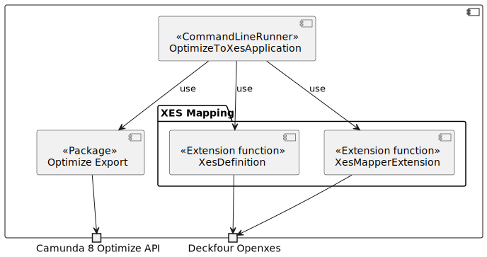

# Optimize to XES

[](https://github.com/envite-consulting/optimize-to-xes/actions/workflows/continuous-integration.yml)
[](https://github.com/envite-consulting/optimize-to-xes/actions/workflows/maven-publish.yml)
[](https://github.com/envite-consulting/optimize-to-xes/actions/workflows/native-image.yml)

Export [raw data from Camunda Optimize](https://docs.camunda.io/optimize/apis-tools/optimize-api/report/get-data-export/) 
and convert it to [XES](https://xes-standard.org/) for Predictive Process Monitoring

# Table of Contents

* [✨Features](#features)
  * [📤 Camunda Optimize to XES](#-camunda-optimize-to-xes)
  * [📊 XES - eXtensible Event Stream](#-xes---extensible-event-stream)
* [🚀 Getting Started](#-getting-started)
  * [Execute native-image](#execute-native-image)
  * [Configuring `application.yaml`](#configuring-applicationyaml)
* [👨‍💻 Developer's Guide](#-developers-guide)
  * [Building a Native Image](#building-a-native-image)
  * [🏗Building Blocks](#building-blocks)
    * [Level 0](#level-0)
    * [Level 1: Optimize Export](#level-1-optimize-export)

# ✨Features

## 📤 Camunda Optimize to XES

Here's the scoop on this project: It's your ticket to export your raw process data from Camunda Optimize using the 
mighty [Data Export API](https://docs.camunda.io/optimize/apis-tools/optimize-api/report/get-data-export/). 🚀  
🔍 For the smoothest experience, consider applying a filter to show only completed instances. 🌟 This helps streamline 
your view and focus on what's done! ✅🚀

Afterward, we work our magic to transform it into the fantastic world of [XES](#-xes---extensible-event-stream). 🪄✨

🔮 Dive into the world of possibilities! Utilize XES for Predictive Process Monitoring, or easily import your XES file 
into a Process Mining tool like [Disco](https://fluxicon.com/disco/) 🚀. Uncover insights and let the magic of data 
unfold! 🌟💼

## 📊 XES - eXtensible Event Stream

We rely on [XES](https://www.xes-standard.org/openxes/start), which is like a superhero cape for event data! 🦸‍♂️ 
It's a widely recognized standard that helps us structure and store event data in a machine-friendly format. This 
format is a go-to choice for process mining, allowing us to save and share event logs effortlessly. It's like a 
treasure map for uncovering insights in the world of processes and workflows! 🗺️

For our Java-powered adventures, we especially use this [OpenXES](http://code.deckfour.org/xes/) implementation. 🧑‍💻

# 🚀 Getting Started

## Execute native-image

You can simply download the latest native-image from the [releases here](https://github.com/envite-consulting/optimize-to-xes/releases/latest) and
execute it with the following options:

```shell
./optimize-to-xes \
  --optimize.base-url='optimize_base_url' \
  --optimize.report-id='report_id' \
  --optimize.client-id='client_id' \
  --optimize.client-secret='client_secret' \
  --xes-mapping.base-path='<optional-path-to-output-dir>'
```

If you want to provide a static Bearer Token you could ignore `client-id` and `client-secret` and 
add `bearer-token` instead.

## Configuring `application.yaml`

To set up your configuration in `application.yaml`, follow these steps:

1. Include the Optimize base URL.
2. Specify the Raw Data Report ID.
3. Add the Client ID and Secret.
4. *Optionally:* Specify the base bath for the resulting XML(s).

If you want to provide a static Bearer Token you could ignore `client-id` and `client-secret` and  
add `bearer-token` instead.

Once you've completed these configurations, you'll be prepared to retrieve the data and convert it to XES format 🎉

To install all dependencies, run the following command:

```shell
$ ./mvnw install
```

To install and start the commandline runner, use the command below:

```shell
$ ./mvnw spring-boot:run
```

# 👨‍💻 Developer's Guide

## Building a Native Image

> **🚀📚 Requirements:**
> * Java 21

Usually, running `./mvnw clean native:compile -Pnative` should be all you need to create the native image. 🚀

However, there's a little twist 🌀 – due to some reflection magic happening in the OpenXES Library, we'll need to 
catch and pass all those reflections to the native image building process. It's like adding a touch of wizardry to 
your development journey! 🧙‍♂️✨🏗️

```shell
# Build the native image
./mvnw clean native:compile -Pnative

# Find all reflection usages: A native-image folder will be places in the root of the project.  
java -Dspring.aot.enabled=true \
    -agentlib:native-image-agent=config-output-dir=./src/main/resources/META-INF/native-image \
    -Doptimize.base-url='<base_url>' \
    -Doptimize.report-id='<report_id' \
    -Doptimize.client-id='<client_id>' \
    -Doptimize.client-secret='client_secret' \
    -Dxes-mapping.base-path='target' \
    -jar target/optimize-to-xes-<version>.jar

# Build the native image again with the extended information on the reelection
./mvnw clean native:compile -Pnative
```

## 🏗Building Blocks

The building block view shows the static decomposition of the system into building blocks as well as their dependencies.

### Level 0

Level 0 is the white box description of the overall system together with black box descriptions of all contained building blocks.



| Element                  | Description                                                                                       |
|--------------------------|---------------------------------------------------------------------------------------------------|
| OptimizeToXesApplication | Main Application which will be executed as Command Line Runner.                                   |
| Optimize                 | See [Level 1: Optimize Export](#level-1-optimize-export).                                         |
| XesDefinition            | Extension function providing extensions for the `XesDefinition` like an export to XML.            |
| XesMapperExtension       | Extension function to map the Domain model of [Optimize Export](#level-1-optimize-export) to XES. |

### Level 1: Optimize Export

Level 1 zooms into the `Optimize Export` building blocks of level 0. Thus, it contains the white box description of selected building blocks of level 0, together with black box descriptions of their internal building blocks on handling the export of the data from Camunda 8 Optimize. 


| Element                     | Description                                                                                         |
|-----------------------------|-----------------------------------------------------------------------------------------------------|
| OptimizeDataQuery           | Input port allowing to query for an export.                                                         |
| DownloadService             | Implementation of the input port.                                                                   |
| OptimizeData                | Domain Model representing the list of `ProcessInstances`.                                           |
| ProcessInstance             | Domain Model representing a historic process instance with all its `FlowNodeInstances`              |
| FlowNodeInstance            | Domain Model representing a single flow node in a process instance.                                 |
| RawDataQuery                | Output port allow an abstract way to query for an Optimize export (Dependency Inversion Principal). |
| OptimizeRawDataQueryService | Implementation of the output port.                                                                  |
| OptimizeBearerTokenService  | Support Component querying for a Bearer Token wich is used to query the data.                       |